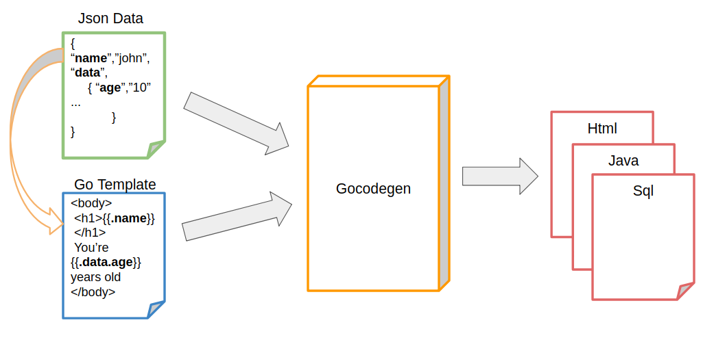

# Introduction
This repository contains a Go code generator based on Go Template and a set of Go Template examples.
                                                  

## Go code generator
Go templates are one of the best choice to build a fast and small code generation tool. 

The sample code generator tool presented here can generate any type of code from Go templates and json or yaml data. 




# Installation
Download zip archive from github or clone this repository

`git clone https://github.com/phcollignon/Go-Template`


# Usage
You can use it as a command line or as a go library to dynamically generate code in go programs.

## command line
Look in `Go-Template/dist` directory for the binary matching your platform and add it to your `PATH` environment variable.

```
cd Go-Template/src/examples/01-simple
gocodegen-linux-amd64 -d email.json -t email.tmpl
```

## output directory 

By default, generated files are created in the same folder as the json file.  

You can change the ouput directory with `-o outputdirectory`

`gocodegen-linux-amd64 -d email.json -t email.tmpl -o /tmp/gocodegentest`

## multiple file generation
If your Json Data file is designed to generate multiple files (see Example 5 below), use the following command :

`gocodegen-linux-amd64 -d mailing.json -t mailing.tmpl -m multi`

# Examples

We provide here some code generation examples, please note that gocodgen is based on go templates, so for more advanced features, you can look at go template documentation.

## 01 :  Simple code generation

Let's suppose the following email template :

```
Dear {{.Name}},

Hello, 

We would like to assign some tasks for {{.Project}} project :
{{range .Topics}}
    - {{.}}
{{end}}

Can we plan a meeting on {{.Date}} ?

Regards,
```

And the following data :

```
{
    "Name": "Phil",
    "Date": "01/01/2018",
    "Project": "Go-Template",
    "Topics": [
        "write documentation",
        "publish to github.com",
        "add more examples"
    ]
}

```

The following command,

`gocodegen-linux-amd64 -d 01-simple/email.json -t 01-simple/email.tmpl`

generates `email.generated.txt` file

```

Dear Phil,

Hello, 

We would like to assign some tasks for Go-Template project :

    - write documentation

    - publish to github.com

    - add more examples


Can we plan a meeting on 01/01/2018 ?

Regards,

```


## 02 :  Loop on Json Data

Let's suppose the following template to generate SQL code for table create :

```
{{range  .Schema.Table}}
	CREATE TABLE {{ .Name}} (
		{{range $idx, $column := .Column}}
			{{if  $idx }} , {{end}}{{ $column.Name}} {{$column.Type}} {{if $column.Size }} {{$column.Size}} {{end}}
		{{end}}
		)
{{end}}

```

And the following schema definition :

```
{
  "Schema": {
    "Table": [
      {
        "Name": "EMPLOYEE",
        "Column": [
          {
            "Name": "ID",
            "Type": "INTEGER"
          },
          {
            "Name": "FIRSTNAME",
            "Type": "VARCHAR",
            "Size": "256"
          },
          {
            "Name": "LASTNAME",
            "Type": "VARCHAR",
            "Size": "256"
          },
          {
            "Name": "AGE",
            "Type": "INTEGER"
          }
        ]
      },
      {
        "Name": "PRODUCT",
        "Column": [
          {
            "Name": "ID",
            "Type": "INTEGER"
          },
          {
            "Name": "NAME",
The following command,

            "Type": "VARCHAR",
            "Size": "256"
          },
          {
            "Name": "PRICE",
            "Type": "REAL"
          }
        ]
      }
    ]
  }
}

```

`gocodegen-linux-amd64 -d schema.json -t createtable.tmpl`

generates the following file

```
	CREATE TABLE EMPLOYEE (	
			ID INTEGER 	
			 , FIRSTNAME VARCHAR  256 		
			 , LASTNAME VARCHAR  256 		
			 , AGE INTEGER 		
		)

	CREATE TABLE PRODUCT (		
			ID INTEGER 		
			 , NAME VARCHAR  256 		
			 , PRICE REAL 		
		)
```

## 03 :  Add conditions and Golang template functions

Let's imagine you want to compare some numbers :

```
{{ range .Number}}
    {{if eq  .n1 .n2 }}
        {{- .n1}} = {{.n2}}
    {{else}}
        {{- if lt .n1 .n2 }}
            {{- .n1}} < {{.n2}}
        {{else}}
            {{- .n1}} > {{.n2}}
        {{end}}
    {{end}}
{{end}}

```

And the following numbers to be compared :

```
{
    "Number" : [
        {"n1":1,"n2":2},
        {"n1":5,"n2":3},
        {"n1":2,"n2":2},
        {"n1":1,"n2":5},
        {"n1":6,"n2":6},
        {"n1":5,"n2":2}

    ]
}

```

`gocodegen-linux-amd64 -d numbers.json -t numbers.tmpl`

generates the following file

```
    1 < 2
    5 > 3
    2 = 2
    1 < 5
    6 = 6
    5 > 2
 
```
## 04 :  Custom functions

Let's now consider a more advanced sample where you want to apply some custome functions in your code generation.

The JavaBeans setter and getter functions must be written as `getPropertyName()` for `propertyName` property.

First, add a custom function in `my-funcs.go` file


```
var MyFuncMap = map[string]interface{}{
	"ToGetterName": ToGetterName,
	"ToSetterName": ToSetterName}

func ToGetterName(name string) string {
	return "get" + strings.Title(name)
}
func ToSetterName(name string) string {
	return "set" + strings.Title(name)
}

```

Now you can use that custom function in your Go template :

```
public class User implements java.io.Serializable {
    {{range .User.Property }}
        private {{.Type}} {{ .Name  }};
    {{end}}


    {{range .User.Property }}
        public {{.Type}} {{ .Name | ToGetterName }}(){
            return this.{{.Name}};
        }
    {{end}}

    {{range .User.Property }}
        public void {{ .Name   | ToSetterName   }}({{.Type}} {{.Name}}){
            this.{{.Name}} = {{.Name}};
        }
    {{end}}
}
```

Either compile the gocodgen for your platform or install Go and run 
`go run main.go my-funcs.go -d numbers.json -t numbers.tmpl`

For the following json data, 

```
{
    "User": {
        "Name" : "Person",
        "Property": [
            {
               "Name": "firstName",
               "Type": "String"
            },
            {
                "Name": "lastName",
                "Type": "String"
            },
            {
                "Name": "age",
                "Type": "Integer"
            }
        ]
    }
}
 
```

You get this result :

```
public class User implements java.io.Serializable {
    
        private String firstName;
    
        private String lastName;
    
        private Integer age;
    


    
        public String getFirstName(){
            return this.firstName;
        }
    
        public String getLastName(){
            return this.lastName;
        }
    
        public Integer getAge(){
            return this.age;
        }
    

    
        public void setFirstName(String firstName){
            this.firstName = firstName;
        }
    
        public void setLastName(String lastName){
            this.lastName = lastName;
        }
    
        public void setAge(Integer age){
            this.age = age;
        }
    
}

```


## 05 :  Generate multiple files

Sometime, you want to generate a set of files from some data.

The most obvious example is a mailing .. let's have the same email as in Example 01

```
Dear {{.Name}},

Hello, 

We would like to assign some tasks for {{.Project}} project :
{{range .Topics}}
    - {{.}}
{{end}}

Can we plan a meeting on {{.Date}} ?

Regards,

```

You include in your Json Data file, a `Files` key containing a table of objects.
Each object has a `FileName` used to create the file, and a `Data` object which container the code generation data.

```
{
    "Files": [{
        "FileName": "test1",
        "Data": {
            "Name": "phil",
            "Date": "01/01/2018",
            "Project": "Go-Template",
            "Topics": [
                "write documentation",
                "publish to github.com",
                "add more examples"
            ]
        }
    },
    {
        "FileName": "test2",
        "Data": {
            "Name": "john",
            "Date": "01/01/2018",
            "Project": "Go-Template",
            "Topics": [
                "write documentation",
                "publish to github.com",
                "add more examples"
            ]
        }
    },
    {
        "FileName": "test3",
        "Data": {
            "Name": "peter",
            "Date": "01/01/2018",
            "Project": "Go-Template",
            "Topics": [
                "write documentation",
                "publish to github.com",
                "add more examples"
            ]
        }
    }]
}

```

The following command (do not forget `-m multi` flag) :

`gocodegen-linux-amd64 -d mailing.json -t mailing.tmpl -m multi`

generates 3 different files :

test1 :

```
Dear phil,

Hello, 

We would like to assign some tasks for Go-Template project :

    - write documentation

    - publish to github.com

    - add more examples


Can we plan a meeting on 01/01/2018 ?

Regards,
 
```

test2 :

```
Dear john,

Hello, 

We would like to assign some tasks for Go-Template project :

    - write documentation

    - publish to github.com

    - add more examples


Can we plan a meeting on 01/01/2018 ?

Regards,

 
```

test3 :

```

Dear peter,

Hello, 

We would like to assign some tasks for Go-Template project :

    - write documentation

    - publish to github.com

    - add more examples


Can we plan a meeting on 01/01/2018 ?

Regards,

 
```

## Go templates examples
Here is the list of Go template examples.  You can use them in your own code or with the generator documented below.

| directory | template               | values       | description                                           |
| --------- | ---------------------- | ------------ | ----------------------------------------------------- |
|  01-values | [contact.tpl](./src/examples/01-values/contact.tpl) | [contact.json](./src/examples/01-values/contact.json) | values interpolation   |
|  01-values | [contact-with.tpl](./src/examples/01-values/contact-with.tpl) | [contact.json](./src/examples/01-values/contact.json) | values interpolation with scoped object "with" action  |
|  01-values | [contact-key-index.tpl](./src/examples/01-values/contact-key-index.tpl) | [contact.json](./src/examples/01-values/contact.json) | values and keys interpolation with  "index" function  |
|  01-values | [email.tpl](./src/examples/01-values/email.tpl) | [email.yaml](./src/examples/01-values/email.yaml) | values interpolation with array index  |
|  01-values | [properties-whitespace.tpl](./src/examples/01-values/properties-whitespace.tpl) | [properties-whitespace.yaml](./src/examples/01-values/properties-whitespace.yaml) | manage whitespace in java property file  |
|  02-loop | [db-schema.tpl](./src/examples/02-loop/db-schema.tpl) | [db-schema.json](./src/examples/02-loop/db-schema.json) | Iterate on values  |
|  03-conditions | [logic.tpl](./src/examples/03-conditions/logic.tpl) | [logic.json](./src/examples/03-conditions/logic.json) | Logic functions  |
|  03-conditions | [numbers.tpl](./src/examples/03-conditions/numbers.tpl) | [numbers.json](./src/examples/03-conditions/numbers.json) | Logic operators  |
|  04-builtin-functions | [logs.tpl](./src/examples/04-builtin-functions/logs.tpl) | [logs.json](./src/examples/04-builtin-functions/logs.json) | Index and length of a list  |
|  04-builtin-functions | [print.tpl](./src/examples/04-builtin-functions/print.tpl) | [print.json](./src/examples/04-builtin-functions/print.json) | Formatted print function  |
|  04-builtin-functions | [escape.tpl](./src/examples/04-builtin-functions/escape.tpl) | [escape.json](./src/examples/04-builtin-functions/escape.json) | URL query string, html and javascript escape  |
|  05-sprig-functions | N/A | N/A | [http://masterminds.github.io/sprig/](http://masterminds.github.io/sprig/) |
|  06-custom-functions | [javabean.tpl](./src/examples/06-custom-functions/javabean.tpl) | [javabean.json](./src/examples/06-custom-functions/javabean.json) | Use of custom functions (defined in my-funcs.go)  |
|  07-multiplefiles | [mailing.tpl](./src/examples/07-multiplefiles/mailing.tpl) | [mailing.json](./src/examples/07-multiplefiles/mailing.json) | Generate multiple files with one template an one value file  |
|  08-subtemplate | [template.tpl](./src/examples/08-subtemplate/template.tpl) | [template.json](./src/examples/08-subtemplate/template.json) | Call a named sub-template  |
